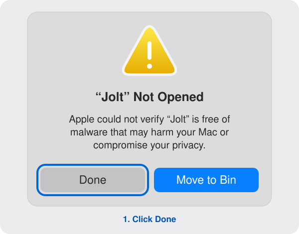
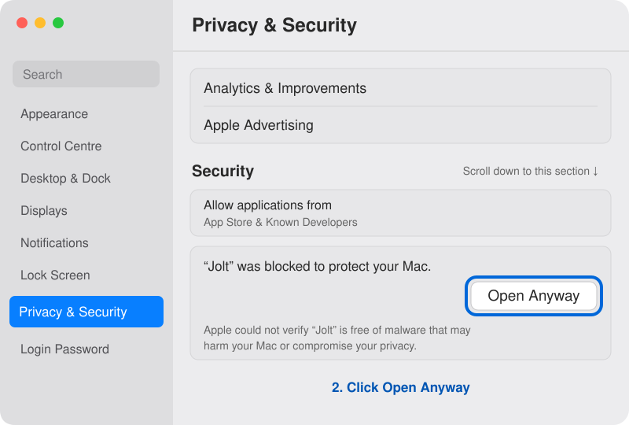
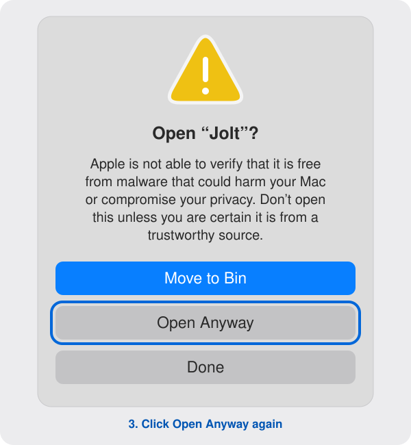

<p align="center">
  
</p>

<h1 align="center">Jolt for macOS</h1>

<p align="center">
  <strong>Your Jira issues. One shortcut away.</strong><br>
  Find, preview, and share Jira issues from a native Mac app.
</p>

<p align="center">
  <a href="https://smnsc.github.io/Jolt/">Website</a> ·
  <a href="#get-started">Get started</a> ·
  <a href="#search-your-way">Search guide</a> ·
  <a href="dev-docs/DEVELOPMENT.md">Build from source</a> ·
  <a href="https://ko-fi.com/simonsc">Support Jolt</a>
</p>

---

Press **⌥ J**, type what you need, and get back to work. Jolt brings Jira Cloud search to your desktop with autocomplete, quick previews, and shortcuts that keep your hands on the keyboard.

## Features

- **One shortcut away** — Press **⌥ J** or set your own global shortcut to open Jolt, use **↑ / ↓** to select a result, and press **Return** to open it in Jira
- **Flexible keyboard-driven search** — Combine keywords with `@project`, `#type`, `~assignee`, and `>reporter`, with autocomplete as you type. Use `#bug` or `#epic` to narrow by issue type, or toggle projects and issue types in the filter bar directly below the main text field
- **Customisable appearance** — Choose light, dark, or system appearance and choose a clear or tinted background
- **Quick actions menu** — Press **⌥ Return** to copy an issue’s key and title, copy an HTML-formatted link, or open the issue in Jira
- **Lightweight issue previews** — Press **→** at the end of your search text to read the selected issue’s description, including headings, lists, links, and code blocks

Jolt is **read-only**: it searches your issues without changing them. Your API token and connection details are stored in **macOS Keychain**.

## Get started

You’ll need **macOS 14 or later**, a **Jira Cloud account**, and an **Atlassian API token**.

### 1. Install Jolt

Download a DMG from [GitHub Releases](https://github.com/smnsc/Jolt/releases), open it,
and drag **Jolt** to **Applications**. If no release is listed yet, build from source below.

Jolt is ad-hoc signed and **not Apple-notarized**. Follow the first-launch guide in Step 2 if macOS blocks it.

Jolt checks for updates daily by default. **Settings → Updates** offers On Launch,
Daily, Monthly (every 30 days), or Never, plus manual checks. Installation requires
your confirmation. Jira may need reconnecting
after an update because ad-hoc builds have different Keychain identities.

#### Build from source

With **Xcode 26 or later** installed, run these commands from your checkout:

```sh
scripts/build-app.sh
open build/Jolt.app
```

See the [development guide](dev-docs/DEVELOPMENT.md) for Xcode setup, testing, and release packaging.

### 2. Open Jolt for the first time

**macOS blocked Jolt? [See the illustrated first-launch guide on the website](https://smnsc.github.io/Jolt/#mac-permissions)** or expand the images below.

1. Launch **Jolt** from Applications. If you see **“Jolt” Not Opened**, click **Done**.
2. Open **System Settings → Privacy & Security**, scroll down to **Security**, and click **Open Anyway** beside the Jolt message.
3. In the final **Open “Jolt”?** alert, click **Open Anyway** again.
4. When macOS asks for a password, enter your **Mac login password** and confirm. Then connect your Jira account.

Only approve a download you trust. See [Apple’s instructions](https://support.apple.com/en-us/102445).

<details>
<summary><strong>Show first-launch illustrations — Done → Open Anyway → Confirm</strong></summary>

#### Click Done



#### Open System Settings → Privacy & Security, scroll down, and click Open Anyway



#### Confirm Open Anyway



#### Enter your Mac login password

When macOS asks for a password, enter the password you use to log in to your Mac and confirm.

Illustrations based on macOS prompts; wording may vary by version.

</details>

### 3. Connect your Jira account

1. Create a token in your [Atlassian API token settings](https://id.atlassian.com/manage-profile/security/api-tokens).
2. Open Jolt and enter your Jira site, such as `your-team.atlassian.net`, and your Atlassian account email.
3. Paste the token into the **API key** field and connect.

Regular and scoped tokens are supported with the Jira read permissions Jolt needs.

#### Why an API key instead of browser sign-in?

An API key (Atlassian calls it an **API token**) lets Jolt connect directly to Jira
on your behalf. Atlassian’s documented [Jira OAuth 2.0 (3LO) flow](https://developer.atlassian.com/cloud/jira/platform/oauth-2-3lo-apps/)
requires an app client secret. A distributed Mac app cannot keep that shared
secret private. Supporting this flow safely would require a hosted authentication
service, which Jolt does not have, so Jolt uses a personal API token instead.

Your token is stored in **macOS Keychain** and sent only to Atlassian. Jolt only
reads Jira data; it does not change issues, even if your token grants broader
permissions. You can revoke the token at any time in your
[Atlassian API token settings](https://id.atlassian.com/manage-profile/security/api-tokens).

### 4. Find your first issue

Press **⌥ J** and search by keyword or issue key. Use **↑ / ↓** to select a result, **Return** to open it in Jira, **→** at the end of the search text to preview it, or **⌥ Return** for copy and open actions.

## Search your way

Start with a few words. Add shortcuts to narrow things down.

| Search | Find |
| --- | --- |
| `pdf export` | Issues matching both word prefixes |
| `DEV-1234` | A specific issue |
| `@dev #bug` | Bugs in the DEV project |
| `~me` | Issues assigned to you |
| `>me` | Issues reported by you |
| `@dev ~me pdf` | Your DEV issues matching “pdf” |
| `#"User Story"` | An issue type with spaces in its name |

Choose projects, issue types, and people from autocomplete. Use multiple shortcuts of the same kind to include either value: `@dev @it` searches both projects. Different kinds narrow the search together: `@dev #bug ~me` finds DEV bugs assigned to you.

Need more results? **See more results in Jira** opens the same search in your browser.

## For developers

Built with SwiftUI and AppKit. Open `Package.swift` in Xcode to explore the app.

[Development & releases](dev-docs/DEVELOPMENT.md) · [Architecture](dev-docs/ARCHITECTURE.md) · [Search & JQL](dev-docs/SEARCH.md) · [Contributor guide](AGENTS.md)

## Publish a release (maintainers)

After the one-time [GitHub setup](dev-docs/RELEASING.md#one-time-setup), add release
notes at `dev-docs/releases/0.1.2.md`, commit and push your changes to `main`, then run:

```sh
scripts/release.sh 0.1.2 116
```

Supply the release version and its explicit positive-integer build number. GitHub Actions tests and builds Jolt, signs the
Sparkle update using `SPARKLE_PRIVATE_KEY` in the `release` environment, creates
the GitHub Release with DMG and update ZIP downloads, commits the signed feed to
`docs/appcast.xml`, and starts website deployment. Download buttons automatically
link to the matching DMG; no manual HTML edits are needed. Follow both in the repository’s **Actions** tab. Releases remain
ad-hoc signed and not Apple-notarized. See the [release guide](dev-docs/RELEASING.md)
for setup, checks, and recovery.

## License and support

Jolt is available under the [MIT license](LICENSE). See [third-party notices](THIRD_PARTY_NOTICES.md)
for Sparkle and its dependencies. Donations are optional: [Support Jolt on Ko-fi](https://ko-fi.com/simonsc).

Jolt is an independent project, not affiliated with Atlassian. It sends Jira requests
to Atlassian and update requests to GitHub. It does not send Jira credentials with
update checks or collect usage analytics.

Maintainers: see the [release guide](dev-docs/RELEASING.md) for GitHub Pages, signed
updates, and the Homebrew tap.
